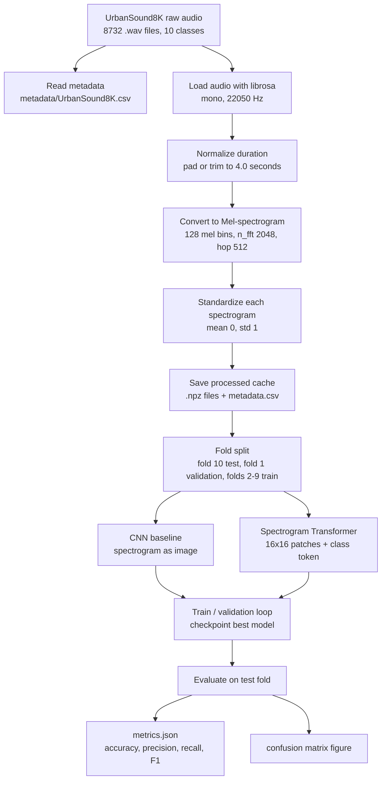

# MVP 進度追蹤

更新日期：2026-08-13

這份文件用來集中追蹤 UrbanSound8K 聲音分類 MVP 的已完成、未完成與下一步。之後每次程式、資料、實驗、圖表或論文草稿有重要更新時，都要同步更新本文件。

## 目前結論

MVP 已完成，可展示端到端流程：UrbanSound8K 音訊已下載驗證，已轉成 Mel-spectrogram，CNN baseline 與 Spectrogram Transformer 都能訓練、評估並輸出 metrics 與 confusion matrix。CNN 已完成 validation-only 受控資料增強搜尋，唯一最佳設定的 fold 10 test Accuracy 為 0.8471、Macro F1 為 0.8536。EMA validation 比較與固定 3-seed probability ensemble 亦已完成，但都沒有超越已鎖定的單一 CNN，因此正式設定維持 EMA 關閉且不採用 ensemble。

整個論文專案尚未完成，因為固定 CNN 設定的正式 10-fold cross-validation、結果解讀與最終 8 頁論文仍待完成。

## 實作流程圖



## 資料與張量尺寸變化

### Preprocessing 變化

| 步驟 | 輸入 | 參數 / 操作 | 輸出 |
| --- | --- | --- | --- |
| Raw dataset | 8732 個 `.wav` 檔 | UrbanSound8K 官方 10 folds | `audio/fold1` 到 `audio/fold10` |
| Metadata | `UrbanSound8K.csv` | 讀取 `slice_file_name`、`fold`、`classID`、`class` | 8732 筆標籤紀錄 |
| Audio loading | 每個原始音訊長度不一 | `sample_rate=22050`、mono | 1D audio array |
| Duration normalization | 1D audio array | 補 0 或截斷到 `4.0` 秒 | `88200` samples |
| Mel-spectrogram | `88200` samples | `n_mels=128`、`n_fft=2048`、`hop_length=512` | `128 x 173` spectrogram |
| Standardization | `128 x 173` spectrogram | 每個 spectrogram 各自做 mean/std normalize | `128 x 173` float32 |
| Cache | `128 x 173` float32 + label | `np.savez_compressed` | 每筆一個 `.npz` |
| Processed metadata | 8732 processed items | 保存 fold、class、path | `data/processed/urbansound8k_mels/metadata.csv` |

### Fold 10 正式切分

目前正式 Transformer 使用 `--fold 10`：

| Split | Fold | 樣本數 | Batch size | 每個 epoch batch 數 |
| --- | --- | ---: | ---: | ---: |
| Train | folds 2-9 | 7022 | 32 | 220 |
| Validation | fold 1 | 873 | 32 | 28 |
| Test | fold 10 | 837 | 32 | 27 |

說明：train 的 `7022 / 32 = 219.44`，所以每個 epoch 是 220 個 training batches；最後一個 batch 會小於 32。validation 和 test 同理。

### Transformer 內部形狀變化

正式 Transformer 設定來自 `configs/transformer_baseline.yaml`：

| 階段 | Shape / 數量 | 說明 |
| --- | --- | --- |
| DataLoader batch | `[32, 1, 128, 173]` | batch size 32、1 channel、Mel-spectrogram 高 128、寬 173 |
| Patch embedding | `[32, 128, 8, 10]` | `patch_size=[16,16]`，產生 `8 x 10 = 80` 個 patches，每個 patch embed 到 128 維 |
| Flatten patches | `[32, 80, 128]` | 每筆資料 80 個 patch tokens |
| Add class token | `[32, 81, 128]` | 80 個 patch tokens + 1 個 class token |
| Transformer encoder | `[32, 81, 128]` | `depth=3`、`num_heads=4` |
| Classification head | `[32, 10]` | 10 個 UrbanSound8K 類別 logits |

正式訓練設定：

| 設定 | 數值 |
| --- | ---: |
| Epochs | 10 |
| Batch size | 32 |
| Learning rate | 0.0005 |
| Weight decay | 0.0001 |
| Transformer depth | 3 |
| Attention heads | 4 |
| Embedding dimension | 128 |
| MLP ratio | 2.0 |
| Dropout | 0.1 |

### CNN baseline 內部形狀變化

CNN baseline 將 Mel-spectrogram 當成單通道影像。輸入 shape 同樣是 `[batch, 1, 128, 173]`。

| 階段 | Shape / 數量 | 說明 |
| --- | --- | --- |
| DataLoader batch | `[32, 1, 128, 173]` | batch size 32 |
| CNN block 1 | `[32, 32, 64, 86]` | 兩層 convolution + max pooling |
| CNN block 2 | `[32, 64, 32, 43]` | channel 增加、時間/頻率維度下降 |
| CNN block 3 | `[32, 128, 16, 21]` | 繼續抽取高階局部特徵 |
| CNN block 4 | `[32, 256, 8, 10]` | 最後 convolution feature map |
| Adaptive average pooling | `[32, 256, 1, 1]` | 壓成固定長度 feature |
| Classification head | `[32, 10]` | 10 個 UrbanSound8K 類別 logits |

CNN 已在 Colab GPU 完成正式 fold 10 長訓練、受控 augmentation 搜尋、EMA 與 3-seed ensemble 實驗；本機 CPU 僅保留 smoke run 用途。

## 已做到

| 項目 | 狀態 | 證據 / 路徑 | 備註 |
| --- | --- | --- | --- |
| 建立 Python 專案依賴 | 完成 | `requirements.txt` | 包含 PyTorch、Librosa、soundata 等 |
| 下載 UrbanSound8K | 完成 | `data/raw/UrbanSound8K_soundata/` | 8732 個音訊檔，不提交到 git |
| 驗證 UrbanSound8K | 完成 | `soundata.validate()` | 已確認資料集完整 |
| 音訊轉 Mel-spectrogram | 完成 | `data/processed/urbansound8k_mels/` | 8732 筆處理後資料，不提交到 git |
| 資料集 loader | 完成 | `src/data/urbansound8k.py` | 支援 fold split、preload、smoke sample limit |
| CNN baseline 模型 | 完成 | `src/models/cnn.py` | 架構可訓練，正式長訓練待補 |
| Spectrogram Transformer 模型 | 完成 | `src/models/spectrogram_transformer.py` | 作為現代比較模型 |
| Preprocessing script | 完成 | `src/preprocess.py` | 可重複產生 Mel-spectrogram |
| Training script | 完成 | `src/train.py` | 可輸出 checkpoint、history、metrics、confusion matrix |
| EMA checkpoint support | 完成 | `src/utils/ema.py`、`configs/cnn_aug_ema.yaml` | 同次訓練記錄 online/EMA validation 指標；test 預設關閉 |
| 3-seed ensemble support | 完成 | `src/ensemble.py`、`tests/test_seed_ensemble.py` | EMA 與個別 seed test 強制關閉；平均三個 softmax probabilities |
| Evaluation script | 完成 | `src/evaluate.py` | 可重讀 checkpoint 重新評估 |
| Colab CNN baseline notebook | 完成 | `notebooks/2026-07-02-colab-cnn-baseline.ipynb` | 用英文註解記錄 GitHub clone、資料下載、preprocess、CNN 訓練、評估與結果打包流程 |
| Colab CNN + Transformer notebook | 完成 | `notebooks/2026-07-08-colab-cnn-transformer-fold10.ipynb` | 使用 Google Drive cache，支援 CNN baseline 與 Spectrogram Transformer fold 10 訓練、評估、metrics 與結果打包 |
| CNN smoke run | 完成 | `results/cnn_baseline_smoke_fold10/` | 只驗證流程，非正式結果 |
| Transformer smoke run | 完成 | `results/transformer_baseline_smoke_fold10/` | 只驗證流程，非正式結果 |
| Transformer fold 10 正式訓練 | 完成 | `results/transformer_baseline_fold10/` | 10 epochs，完整 train/val/test split |
| Transformer confusion matrix | 完成 | `figures/transformer_baseline_fold10_confusion_matrix.png` | 可用於初步討論 |
| 單元測試 | 完成 | `tests/` | `python -m unittest discover -s tests` 通過 |
| 專案狀態檢查 | 完成 | `scripts/check_project_status.py` | 可快速檢查文件與下一步 |
| Git commit | 完成 | `acda41d`、`7325b43` | 程式與狀態文件已提交 |

## 已取得結果

### CNN 受控資料增強搜尋

完整紀錄：`docs/experiments/2026-08-13-cnn-controlled-augmentation-search.md`

| 指標 | 數值 |
| --- | ---: |
| 最佳 validation Macro F1 | 0.7924 |
| 對應 validation Accuracy | 0.7709 |
| Fold 10 test Accuracy | 0.8471 |
| Fold 10 test Macro F1 | 0.8536 |
| 相較歷史 test Macro F1 0.8413 | +0.0123 |

所有設定選擇只使用 validation Macro F1。Fold 10 test 在唯一設定鎖定後僅執行一次，不能再用於調參。下一步是用固定設定執行 10-fold cross-validation。

### EMA 與 3-seed ensemble 結果

| 實驗 | Validation Macro F1 | Fold 10 test Macro F1 | 決策 |
| --- | ---: | ---: | --- |
| 鎖定單一 CNN | 0.7924 | 0.8536 | 保留為正式設定 |
| EMA | 0.7652 | 未執行 | 相較同次 online 僅 +0.00089，不採用 |
| 3-seed probability ensemble | 0.7699 | 0.8501 | validation 與 test 均未超越單一 CNN，不採用 |

3-seed 使用 seeds 42、123、2026；各 seed 只依 validation Macro F1 保存 checkpoint，個別模型不讀取 test。完整紀錄見 `docs/experiments/2026-08-13-cnn-seed-ensemble.md`。Ensemble fold 10 test 僅在方法鎖定後執行一次，不能再用於調參。

### Transformer fold 10 正式結果

| 指標 | 數值 |
| --- | ---: |
| Accuracy | 0.6547 |
| Macro precision | 0.6879 |
| Macro recall | 0.6711 |
| Macro F1 | 0.6644 |
| Test loss | 1.1418 |

結果來源：`results/transformer_baseline_fold10/metrics.json`

### Smoke run 說明

Smoke run 只用少量資料與 1 epoch 檢查 pipeline 是否能完整執行。它不是正式實驗結果，不應直接寫成論文主要分數。

目前 smoke 設定：

| 設定 | 數值 |
| --- | ---: |
| Epochs | 1 |
| Train samples | 256 |
| Validation samples | 128 |
| Test samples | 128 |
| Batch size | 32 |
| Train batches per epoch | 8 |
| Validation batches per epoch | 4 |
| Test batches | 4 |

## 尚未做到

| 項目 | 狀態 | 原因 / 風險 | 下一步 |
| --- | --- | --- | --- |
| 10-fold cross validation | 未完成 | MVP 先跑 fold 10 | 後續可跑 `--fold all` 或多 fold 平均 |
| EMA validation comparison | 完成 | 改善僅約 0.00089 | 正式設定關閉 EMA |
| 3-seed ensemble | 完成 | validation Macro F1 0.7699，未超越單一 CNN | 保留負結果與重現程式，不採用於正式 10-fold |
| CNN vs Transformer 正式比較表 | 進行中 | 單一 fold 結果已具備，缺 10-fold CNN 統計 | 完成 10-fold 後整理最終表格 |
| 結果圖表解讀 | 未完成 | 目前只有 confusion matrix 與 metrics | 寫出哪些類別容易混淆、可能原因 |
| 文獻整理 | 未完成 | 還沒整理核心 citation | 補 UrbanSound8K、CNN spectrogram、Transformer/AST 相關文獻 |
| 方法章草稿 | 未完成 | 需要把 pipeline 寫成論文語言 | 先寫 Mel-spectrogram + model comparison 方法 |
| 結果與討論草稿 | 未完成 | CNN 正式結果缺失 | 先寫 Transformer 初步結果，CNN 後補 |
| 8 頁 PDF | 未完成 | 需要正文、圖表、引用與排版 | 在結果與方法穩定後生成 |
| 教授確認 Transformer 策略 | 未完成 | 需確認是否接受偏離原 CNN-only definition | 週五會議時說明 CNN baseline + Transformer comparison |

## 下一步優先順序

1. 在獨立分支執行 CNN breakthrough validation study；fold 10 全程封存。
2. 依 folds 1、4、7 平均 validation Macro F1 判斷是否有候選值得取代既有設定。
3. 沒有穩定改善則回到 `main`，以 `configs/cnn_aug_final.yaml` 執行正式 10-fold cross-validation。
4. 整理 mean/std、per-class F1 與 aggregate confusion matrix。
5. 將單一 CNN、突破候選、3-seed ensemble、從零訓練 Transformer 與 pretrained AST 的角色公平寫入 Results 與 Discussion。

## 常用命令

安裝依賴：

```bash
python3 -m venv .venv
source .venv/bin/activate
python -m pip install -r requirements.txt
```

重新 preprocessing：

```bash
python3 -m src.preprocess \
  --raw-dir data/raw/UrbanSound8K_soundata \
  --out-dir data/processed/urbansound8k_mels
```

快速 smoke run：

```bash
python3 -m src.train --config configs/cnn_smoke.yaml --fold 10
python3 -m src.train --config configs/transformer_smoke.yaml --fold 10
```

正式 Transformer fold 10：

```bash
python3 -m src.train --config configs/transformer_baseline.yaml --fold 10
python3 -m src.evaluate --run-dir results/transformer_baseline_fold10
```

正式 10-fold cross validation：

```bash
python3 -m src.train --config configs/cnn_baseline.yaml --fold all
python3 -m src.train --config configs/transformer_baseline.yaml --fold all
```

CNN 論文主結果應改用已鎖定且 EMA 關閉的設定：

```bash
python3 -m src.train --config configs/cnn_aug_final.yaml --fold all
```

說明：`--fold all` 會依序跑 fold 1 到 fold 10，並輸出 `results/<run_name>_10fold_summary.json` 與 `results/<run_name>_10fold_summary.csv`，包含 accuracy、macro precision、macro recall、macro F1、test loss 的平均與標準差。

正式 CNN fold 10：

```bash
python3 -m src.train --config configs/cnn_baseline.yaml --fold 10
python3 -m src.evaluate --run-dir results/cnn_baseline_fold10
```

Colab CNN fold 10：

```text
notebooks/2026-07-02-colab-cnn-baseline.ipynb
```

說明：這個 notebook 用於在 Google Colab GPU 上跑正式 CNN baseline。GitHub repo 是程式碼來源，Colab runtime 只負責下載資料、產生 processed cache、訓練與打包結果。跑完後應把 `results/cnn_baseline_fold10/` 和 `figures/cnn_baseline_fold10*_confusion_matrix.png` 下載回本地，再更新本文件的 CNN metrics。

Colab CNN + Transformer fold 10：

```text
notebooks/2026-07-08-colab-cnn-transformer-fold10.ipynb
```

說明：這個 notebook 是更新版 Colab 執行流程，使用 Google Drive 保存 UrbanSound8K raw audio 與 Mel-spectrogram cache，並在同一份 notebook 中跑 CNN baseline 與 Spectrogram Transformer。跑完後下載 `fold10_model_comparison_artifacts.zip`，再把 CNN/Transformer metrics 更新到本文件。

測試與狀態檢查：

```bash
python3 -m unittest discover -s tests
python3 scripts/check_project_status.py
```

EMA validation-only 比較：

```bash
python3 -m src.train --config configs/cnn_aug_ema.yaml --fold 10
```

此命令仍使用 fold 1 作 validation，但 `evaluation.run_test: false`，所以不會再次評估 fold 10 test。EMA decay 固定為 `0.995`。`validation_metrics.json` 會同時列出最佳 online 的 `best_online_val_f1_macro` 與最佳 EMA 的 `val_f1_macro`；`best_online_model.pt` 保留一般權重的最佳 epoch，`best_model.pt` 保留 EMA 的最佳 epoch。

3-seed probability ensemble：

```bash
python3 -m src.ensemble --config configs/cnn_aug_final.yaml --fold 10 --seeds 42 123 2026
```

此實驗已完成，validation Macro F1 為 0.7699，因此不採用為主要設定。若已有完整結果，程式可用 `--skip-existing` 驗證鎖定設定，但不得重複使用 test 結果作調參。

CNN spectrogram augmentation fold 10 ablation：

```bash
python3 scripts/run_cnn_augmentation_ablation.py --fold 10 --skip-existing
```

此流程依序執行 control、light、balanced、strong 四組設定，排名只使用 validation Macro F1，預設不執行 test。`scripts/run_cnn_controlled_search.py` 會在初始比較後，只以勝出設定逐輪調整單一類別的變因；每輪即時寫入 CSV/Markdown 並備份。只有唯一設定鎖定後，才可明確要求一次 fold 10 test evaluation。資料增強在線上套用於 cached Mel-spectrogram，不需要重新 preprocessing。正式結果尚待 Colab 執行。

CNN breakthrough validation study：

```bash
python3 scripts/run_cnn_breakthrough_search.py --plan-only
python3 scripts/run_cnn_breakthrough_search.py \
  --search-id 20260813_breakthrough_v1 \
  --backup-root /content/drive/MyDrive/urbansound8k_data/experiment_artifacts
```

此研究分支比較五個較大幅度的候選，每個候選只在 development validation folds 1、4、7 上比較，主指標為平均 Macro F1。fold 10 從 training/validation 排除且不執行 test；沒有穩定改善就不合併回 `main`。

## 維護規則

- 每次新增或修改程式、設定、資料處理流程、實驗結果、圖表或論文草稿時，都同步更新本文件。
- 若結果只是 smoke run，必須標示為非正式結果。
- 若結果可放進論文，必須記錄 metrics、路徑、資料 split 與模型設定。
- 大型資料、processed features、results、figures 目前不提交到 git，但路徑要記錄在本文件。
